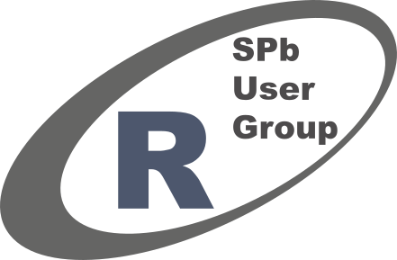

# Welcome!

Twitter: #spbr2

Wifi: Vk_Stud

Pass: VkStudWifi12358

# Расписание

* 15:10 Андрей Бзикадзе — _Параллельное программирование в R_ 
* 15:45 Владимир Волохонский — _Анализ тональности в R_
* 16:20 Перерыв
* 16:40 Иван Иванчей — _Смешанные модели: специфика, задачи, реализация в R_ 
* 17:15 Андрей Яковенко — _О гвоздях и микроскопах_
* 18:00 Продолжение встречи: ресторан "Киликия", наб. канала Грибоедова, 40

# Контакты

+ [http://vk.com/spbrug](http://vk.com/spbrug)
+ [http://www.meetup.com/St-Petersburg-R-User-Group/](http://www.meetup.com/St-Petersburg-R-User-Group/)
+ опросник: [http://goo.gl/forms/Vvg6dLGCc6](http://goo.gl/forms/Vvg6dLGCc6)

<!---
controls: false,
progress: false,
autoSlide: 1000,
-->

